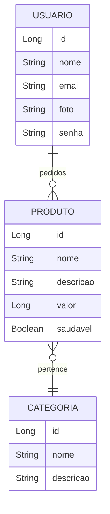

# 🍔 API de Delivery de Comida

## 📝 Descrição  
Esta é uma **API REST** para um sistema de **delivery de comida**. O sistema gerencia:
- **Usuários**, que podem ter produtos.
- **Produtos** (itens disponíveis para compra).
- **Categorias**, que classificam os produtos.

Funcionalidades incluem operações **CRUD** para cada entidade e uma recomendação de produtos saudáveis.  
Esta API está pronta para ser consumida por outros sistemas ou aplicativos.

---

## 🛠️ Tecnologias Utilizadas  
- **Java 17**: Linguagem de programação principal.  
- **Spring Boot**: Framework para desenvolvimento rápido de aplicações.  
- **Spring Data JPA**: Para mapeamento objeto-relacional.  
- **MySQL**: Banco de dados relacional.  
- **Maven**: Gerenciador de dependências.  
- **Spring Web**: Para exposição de APIs REST.  
- **Insomnia**: Para testes e documentação das APIs.  

---

## 🔗 Relacionamento entre Entidades


---

## 📂 Estrutura do Projeto  

### 🧑‍💻 Entidades e Relacionamentos  

#### 1️⃣ **Usuário**
Representa os usuários do sistema, que podem realizar pedidos.  
**Atributos**:  
- `id (Long)`: Identificador único.  
- `nome (String)`: Nome do usuário.  
- `email (String)`: Endereço de e-mail do usuário.  
- `foto (String)`: URL da foto do usuário.  
- `senha (String)`: Senha para autenticação.  
- `produtos (List<Produto>)`: Lista de produtos do usuário.  

**Relacionamento**:  
- Um usuário pode ter vários produtos no histórico de pedidos.  

#### 2️⃣ **Produto**
Representa os itens disponíveis para entrega.  
**Atributos**:  
- `id (Long)`: Identificador único.  
- `nome (String)`: Nome do produto.  
- `descricao (String)`: Descrição detalhada do produto.  
- `valor (Long)`: Preço do produto.  
- `categoria (Categoria)`: Categoria a que o produto pertence.
- `saudavel (Boolean)`: Indica se o produto é saudável ou não.  

**Relacionamento**:  
- Um produto pertence a uma categoria.  

#### 3️⃣ **Categoria**
Classifica os produtos, como "Bebidas", "Sobremesas" ou "Pratos Principais".  
**Atributos**:  
- `id (Long)`: Identificador único.  
- `nome (String)`: Nome da categoria.  
- `descricao (String)`: Descrição detalhada da categoria.  
- `produtos (List<Produto>)`: Lista de produtos na categoria.  

**Relacionamento**:  
- Uma categoria pode ter vários produtos.  

---

## 🌟 Funcionalidades  

### 🔑 CRUD de Usuários
- **Criar**: Cadastro de novos usuários.  
- **Ler**: Recuperar informações de usuários por ID ou listar todos.  
- **Atualizar**: Alterar dados de um usuário existente.  
- **Excluir**: Remover um usuário do sistema.  

### 🛒 CRUD de Produtos
- **Criar**: Adicionar novos produtos ao catálogo.  
- **Ler**: Recuperar informações de produtos por ID ou listar todos.  
- **Atualizar**: Alterar informações de um produto existente.  
- **Excluir**: Remover um produto do catálogo.  

### 🗂️ CRUD de Categorias
- **Criar**: Adicionar novas categorias ao sistema.  
- **Ler**: Recuperar informações de categorias por ID ou listar todas.  
- **Atualizar**: Alterar informações de uma categoria existente.  
- **Excluir**: Remover uma categoria do sistema.  

### 🥗 Recomendação de Produtos Saudáveis
- **Listar Produtos Saudáveis**: Endpoint que retorna todos os produtos pertencentes a categorias marcadas como "saudáveis".  

---

## 🔗 Estrutura dos Endpoints  

### **Usuário**
| Método HTTP | Endpoint          | Descrição                      |
|-------------|-------------------|--------------------------------|
| POST        | `/usuarios`       | Cadastrar novo usuário         |
| GET         | `/usuarios`       | Listar todos os usuários       |
| GET         | `/usuarios/{id}`  | Buscar usuário por ID          |
| PUT         | `/usuarios`       | Atualizar usuário por ID       |
| DELETE      | `/usuarios/{id}`  | Remover usuário por ID         |

### **Produto**
| Método HTTP | Endpoint          | Descrição                      |
|-------------|-------------------|--------------------------------|
| POST        | `/produtos`       | Adicionar novo produto         |
| GET         | `/produtos`       | Listar todos os produtos       |
| GET         | `/produtos/{id}`  | Buscar produto por ID          |
| PUT         | `/produtos`       | Atualizar produto por ID       |
| DELETE      | `/produtos/{id}`  | Remover produto por ID         |

### **Categoria**
| Método HTTP | Endpoint          | Descrição                      |
|-------------|-------------------|--------------------------------|
| POST        | `/categorias`     | Adicionar nova categoria       |
| GET         | `/categorias`     | Listar todas as categorias     |
| GET         | `/categorias/{id}`| Buscar categoria por ID        |
| PUT         | `/categorias`     | Atualizar categoria por ID     |
| DELETE      | `/categorias/{id}`| Remover categoria por ID       |

### **Recomendação**
| Método HTTP | Endpoint                | Descrição                      |
|-------------|-------------------------|--------------------------------|
| GET         | `/produtos/saudaveis`   | Listar produtos saudáveis      |

---

## 🚀 Como Executar o Projeto  

1. **Clone o repositório**:  
   ```bash
   git clone <URL_DO_REPOSITORIO>
   cd <NOME_DO_PROJETO>
---

## 👨‍💻 Contribuidores e suas contribuições


**[Ivan](https://github.com/IJNavi)** 🎯  
- Atuou como **PO**, ajudando a desenvolver o backlog junto à equipe.  
- Realizou as tasks relacionadas a **delete**.

**[Matheus](https://github.com/MatheusSPQ)** 🛠️  
- Criou a base do projeto e configurou o **GitHub** (criação de issues, mesclagem de branchs, e documentação).  
- Corrigiu bugs e propôs padrões a serem seguidos para mesclagem e pull requests.  
- Atuou como um **Scrum Master**, auxiliando nas tasks e no gerenciamento do **kanban**.  
- Realizou as tasks relacionadas a **update**.

**[Lucas](https://github.com/Lucassai)** 🔧  
- Testou, corrigiu e atualizou problemas na **dev**, garantindo a qualidade do código e o funcionamento correto.  
- Realizou as tasks relacionadas a **post**.

**[Nina](https://github.com/Ninaraquel)** 🌱  
- Abraçou o desafio de criar funções adicionais de busca por **produtos saudáveis**.  
- Propôs ideias para novas **features** relacionadas à recomendação.

**[Jaqueline](https://github.com/Jaquelinevalle)** 📄  
- Realizou as tasks relacionadas a **get**.  
- Revisou e garantiu que as **regras de negócios** foram de fato implementadas.

