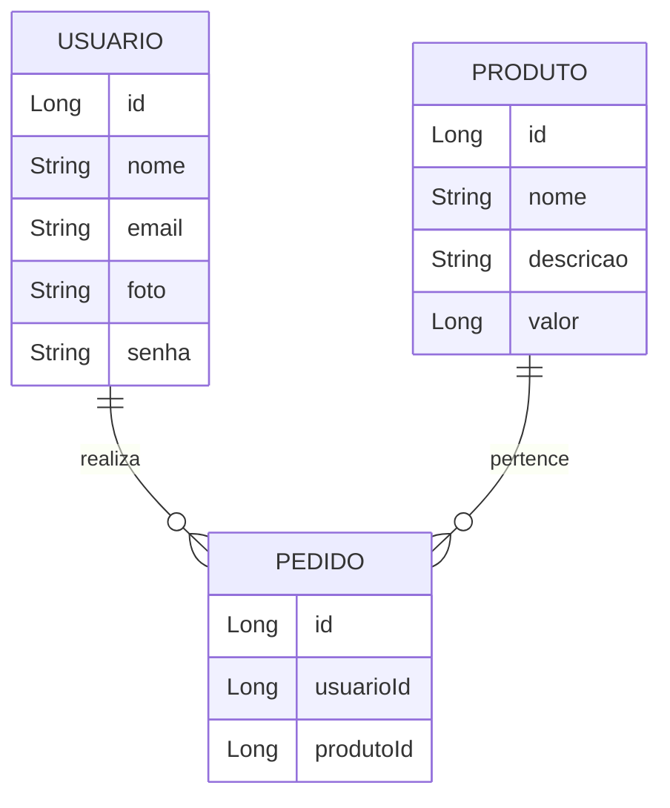

# 🍔 API de Delivery de Comida

## 📝 Descrição
Esta é uma **API REST** para um sistema de **delivery de comida**. O sistema gerencia:  
- **Usuários**, que podem realizar pedidos.  
- **Produtos**, itens disponíveis para compra.  
- **Pedidos**, que representam o histórico de compras dos usuários.  

Funcionalidades incluem operações **CRUD** para cada entidade e uma recomendação de produtos saudáveis.  
Esta API está pronta para ser consumida por outros sistemas ou aplicativos.  

---

## 🛠️ Tecnologias Utilizadas
- **Java 17**: Linguagem de programação principal.  
- **Spring Boot**: Framework para desenvolvimento rápido de aplicações.  
- **Spring Data JPA**: Para mapeamento objeto-relacional.  
- **MySQL**: Banco de dados relacional.  
- **Maven**: Gerenciador de dependências.  
- **Spring Web**: Para exposição de APIs REST.  
- **Insomnia**: Para testes e documentação das APIs.  

---

## 🔗 Relacionamento entre Entidades


# 📂 Estrutura do Projeto

## 🧑‍💻 Entidades e Relacionamentos

### 1️⃣ Usuário
Representa os usuários do sistema, que podem realizar pedidos.

**Atributos**:  
- `id (Long)`: Identificador único.  
- `nome (String)`: Nome do usuário.  
- `email (String)`: Endereço de e-mail do usuário.  
- `foto (String)`: URL da foto do usuário.  
- `senha (String)`: Senha para autenticação.  

**Relacionamento**:  
- Um usuário pode realizar vários pedidos.  

---

### 2️⃣ Produto
Representa os itens disponíveis para entrega.

**Atributos**:  
- `id (Long)`: Identificador único.  
- `nome (String)`: Nome do produto.  
- `descricao (String)`: Descrição detalhada do produto.  
- `valor (Long)`: Preço do produto.  

**Relacionamento**:  
- Um produto pode estar em vários pedidos.  

---

### 3️⃣ Pedido
Representa o histórico de compras de um usuário.

**Atributos**:  
- `id (Long)`: Identificador único.  
- `usuarioId (Long)`: Referência ao usuário que realizou o pedido.  
- `produtoId (Long)`: Referência ao produto do pedido.  

**Relacionamento**:  
- Um pedido pertence a um único usuário e um único produto.  

---

## 🌟 Funcionalidades

### 🔑 CRUD de Usuários
- **Criar**: Cadastro de novos usuários.  
- **Ler**: Recuperar informações de usuários por ID ou listar todos.  
- **Atualizar**: Alterar dados de um usuário existente.  
- **Excluir**: Remover um usuário do sistema.  

### 🛒 CRUD de Produtos
- **Criar**: Adicionar novos produtos ao catálogo.  
- **Ler**: Recuperar informações de produtos por ID ou listar todos.  
- **Atualizar**: Alterar informações de um produto existente.  
- **Excluir**: Remover um produto do catálogo.  

### 📦 CRUD de Pedidos
- **Criar**: Registrar um novo pedido.  
- **Ler**: Recuperar informações de pedidos por ID ou listar todos.  
- **Atualizar**: Alterar informações de um pedido existente.  
- **Excluir**: Cancelar um pedido do sistema.  

---

## 🔗 Estrutura dos Endpoints

### Usuário
| Método HTTP | Endpoint          | Descrição                      |
|-------------|-------------------|--------------------------------|
| POST        | `/usuarios`       | Cadastrar novo usuário         |
| GET         | `/usuarios`       | Listar todos os usuários       |
| GET         | `/usuarios/{id}`  | Buscar usuário por ID          |
| PUT         | `/usuarios     `  | Atualizar usuário por ID       |
| DELETE      | `/usuarios/{id}`  | Remover usuário por ID         |

### Produto
| Método HTTP | Endpoint          | Descrição                      |
|-------------|-------------------|--------------------------------|
| POST        | `/produtos`       | Adicionar novo produto         |
| GET         | `/produtos`       | Listar todos os produtos       |
| GET         | `/produtos/{id}`  | Buscar produto por ID          |
| PUT         | `/produtos     `  | Atualizar produto por ID       |
| DELETE      | `/produtos/{id}`  | Remover produto por ID         |

### Pedido
| Método HTTP | Endpoint          | Descrição                      |
|-------------|-------------------|--------------------------------|
| POST        | `/pedidos`        | Registrar novo pedido          |
| GET         | `/pedidos`        | Listar todos os pedidos        |
| GET         | `/pedidos/{id}`   | Buscar pedido por ID           |
| PUT         | `/pedidos     `   | Atualizar pedido por ID        |
| DELETE      | `/pedidos/{id}`   | Cancelar pedido por ID         |

### **Recomendação**
| Método HTTP | Endpoint                | Descrição                      |
|-------------|-------------------------|--------------------------------|
| GET         | `/produtos/saudaveis`   | Listar produtos saudáveis      |

---

## 🚀 Como Executar o Projeto

1. **Clone o repositório**:  
   ```bash
   git clone <URL_DO_REPOSITORIO>
   cd <NOME_DO_PROJETO>
---
## 👨‍💻 Contribuidores

- [Lucas](https://github.com/Lucassai): Implementação dos endpoints de criação.
- [Matheus](https://github.com/MatheusSPQ): Implementação dos endpoints de atualização.
- [Ivan](https://github.com/IJNavi): Implementação dos endpoints de exclusão.
- [Nina](https://github.com/Ninaraquel): Implementação da recomendação de produtos saudáveis.
- [Jaqueline](https://github.com/Jaquelinevalle): Implementação da listagem de dados.
